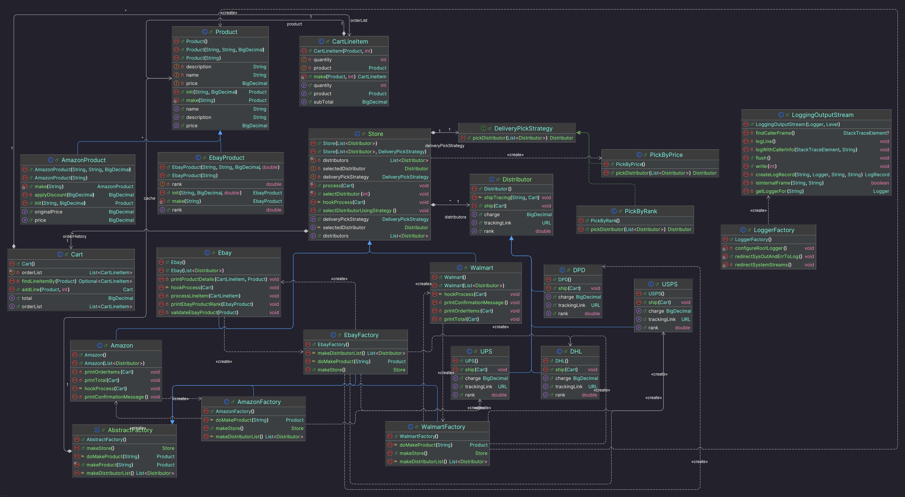

# Abstract Factory Pattern Implementation

This repository contains the implementation of the Abstract Factory pattern, which is an extension of the Factory Method pattern for ECE 696B Advanced Object-Oriented Development.

## Latest Homework: Abstract Factory Implementation

For this homework assignment, I implemented the Abstract Factory pattern with the following features:

1. Created an abstract `AbstractFactory` class with the following interface:
   - `protected abstract List<Distributor> makeDistributorList()`
   - `protected abstract Product doMakeProduct(String name)`
   - `public abstract Store makeStore()`
   - `public final Product makeProduct(String name)` (implements Flyweight pattern)

2. Implemented concrete factories:
   - `AmazonFactory`: Creates AmazonProducts and Amazon store with UPS distributor
   - `EbayFactory`: Creates EbayProducts and Ebay store with multiple distributors
   - `WalmartFactory`: Additional implementation for Walmart store

3. Applied the Flyweight pattern:
   - Added a cache (HashMap) in AbstractFactory
   - Renamed original makeProduct to doMakeProduct (protected)
   - Implemented a new makeProduct method that checks the cache first

4. Updated tests to use the AbstractFactory pattern

## UML Class Diagram

## Key Components

### AbstractFactory

The AbstractFactory is an abstract class that defines the interface for creating products, stores, and distributors. It also implements the Flyweight pattern for caching products.

Key methods:
- `protected abstract List<Distributor> makeDistributorList()`: Creates a list of distributors for the store.
- `protected abstract Product doMakeProduct(String name)`: Creates a product with the given name.
- `public abstract Store makeStore()`: Creates a store instance.
- `public final Product makeProduct(String name)`: Creates a product with the given name, using the Flyweight pattern.

## Benefits of the Abstract Factory Pattern

1. **Enforced Compatibility**: The AbstractFactory ensures that products and stores are compatible.
2. **Reduced Memory Usage**: The Flyweight pattern reduces memory usage by caching products.
3. **Simplified Client Code**: Clients only need to work with the AbstractFactory interface.
4. **Centralized Configuration**: Each factory acts as a configuration for its product family.

## Previous Implementation Features

This project also demonstrates several other design patterns:

1. **Factory Pattern**: Used for creating store-specific products and distributors
2. **Strategy Pattern**: Implemented for delivery selection (PickByRank and PickByPrice)
3. **Adapter Pattern**: AmazonProduct adapts the Product interface to provide a 10% discount
4. **Fluent Interface Pattern**: Applied to CartLineItem for more readable object creation
5. **Template Method Pattern**: Used in the Store class hierarchy