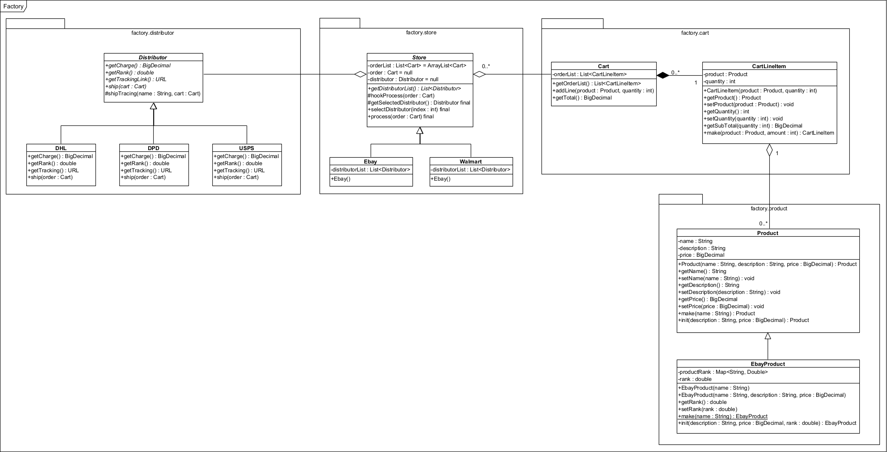
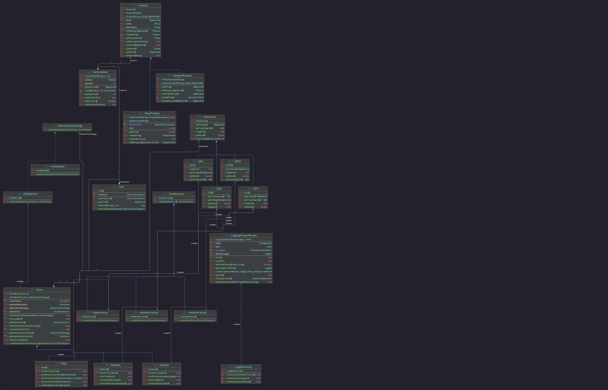

# Factory Pattern Homework

This repository contains my implementation of the Factory Pattern homework assignment for ECE 696B Advanced Object-Oriented Development.

## Implementation Overview

For this homework assignment, I completed the following tasks:

1. Ran the example through UserTest and EbayUserTest to observe the command-line simulation
2. Created UML class diagrams to visualize the initial and final architecture
3. Added UPS delivery service and integrated it with all stores
4. Created an Amazon store that exclusively supports UPS delivery
5. Implemented AmazonProduct as an adapter that reduces prices by 10%
6. Created AmazonUserTest and fixed TotalTest for Amazon
7. Applied the Fluent Interface pattern to CartLineItem and used it in UserTest#makeAnOrder
8. Extracted an abstract Strategy pattern for delivery selection with two implementations:
   - PickByRank: Selects distributors based on highest rank
   - PickByPrice: Selects distributors based on lowest price
9. Replaced all System.out.print* calls with java.util.Logger

## UML Class Diagrams

The UML class diagrams for this project can be found in the `.diagrams` directory:

- [Original Factory UML Class Diagram](.diagrams/original-factory-uml-class-diagram.png) - Shows the initial architecture before my changes

- [Resulting Factory UML Class Diagram](.diagrams/restulting-factory-uml-class-diagram.png) - Shows the final architecture after implementing all requirements

Note: I used IntelliJ's built-in UML feature instead of Visual Paradigm for the "after" diagram in the interest of time.

## Design Patterns Implemented

This project demonstrates several design patterns:

1. **Factory Pattern**: Used for creating store-specific products and distributors
2. **Strategy Pattern**: Implemented for delivery selection (PickByRank and PickByPrice)
3. **Adapter Pattern**: AmazonProduct adapts the Product interface to provide a 10% discount
4. **Fluent Interface Pattern**: Applied to CartLineItem for more readable object creation
5. **Template Method Pattern**: Used in the Store class hierarchy

## Technical Details

- The AmazonProduct adapter reduces prices by 10% by multiplying the original price by 0.9
- BigDecimal multiplication is handled by passing the multiplier as a String ("0.9")
- UPS delivery was added to all stores, with Amazon exclusively supporting UPS
- System.out.println calls were replaced with java.util.Logger for better logging practices