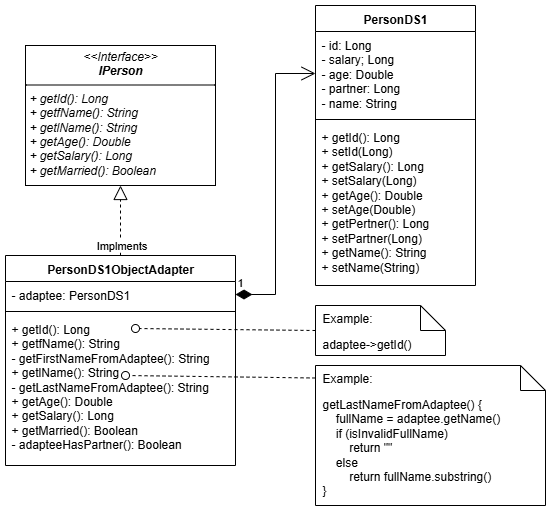
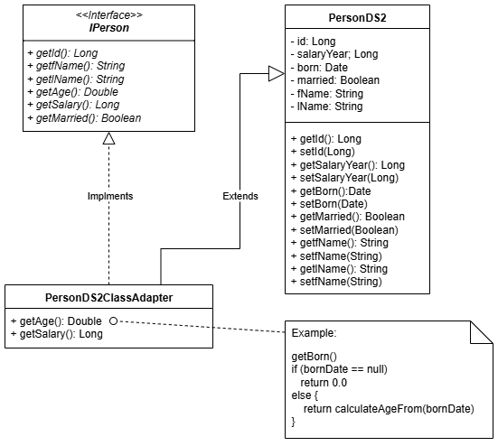

# Adapter Pattern Implementation

This project demonstrates the implementation of the Adapter pattern in a 3-layer application framework called NanoContainer. The application consists of a domain layer, services, and presentation layer.

## Project Overview

The application is a simple console-based system that displays a list of users and reports. The domain model includes a `Person` object that is accessed through services. The person controller uses the service through dependency injection defined in the container.

The project has been transformed to use Maven for dependency management and build automation.

## Adapter Pattern Implementation

The project implements both Object and Class adapters to integrate two different data sources:

1. **Object Adapter (PersonDS1ObjectAdapter)**: Adapts `PersonDS1` objects to the `IPerson` interface
2. **Class Adapter (PersonDS2ClassAdapter)**: Extends `PersonDS2` and implements the `IPerson` interface

### Class Diagrams

#### Object Adapter Pattern


#### Class Adapter Pattern


## Key Differences Between the Adapters

1. **Object Adapter (PersonDS1ObjectAdapter)**:
   - Uses composition ("has-a" relationship)
   - Adapts PersonDS1 which has a single name field and partner ID
   - Splits full name into first and last name
   - Determines marital status based on partner ID

2. **Class Adapter (PersonDS2ClassAdapter)**:
   - Uses inheritance ("is-a" relationship)
   - Extends PersonDS2 which has birth date and yearly salary
   - Calculates age from birth date
   - Converts yearly salary to monthly salary

## How to Run the Project

1. Ensure you have Maven and Java installed
2. Clone the repository
3. Navigate to the project directory
4. Run the application:
   ```
   mvn compile exec:java -Dexec.mainClass="edu.arizona.josesosa.structural.adapter.container.Container"
   ```

## How to Run the Tests

The project includes comprehensive unit tests for both adapters and integration tests for the complete flow.

Run the tests with:
```
mvn test
```

## Test Coverage

The tests verify:
1. Object adapter functionality (name splitting, partner-to-married conversion)
2. Class adapter functionality (age calculation, salary conversion)
3. RemotePersonService integration of both adapters
4. Complete application flow through the Container

## Implementation Notes

- The `IPerson` interface defines the common methods for all Person objects
- The adapters only implement getters, not setters
- The XML files (person-ds1.xml and person-ds2.xml) contain the data for the two different data sources
- The RemotePersonService combines data from both sources and converts them to Person objects