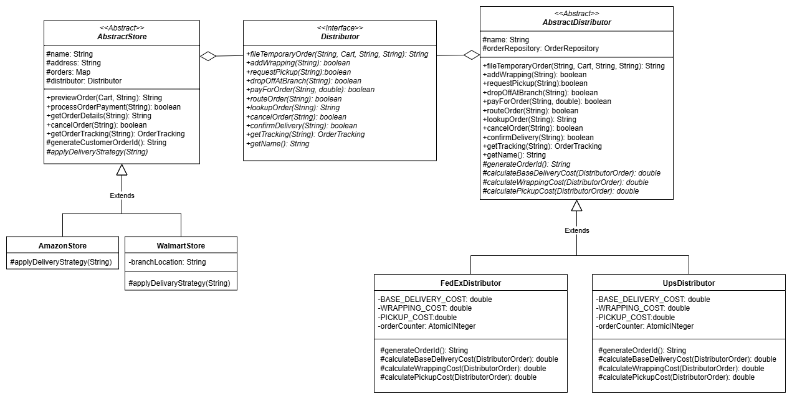

# Bridge Pattern Implementation

## Overview
This project demonstrates the implementation of the Bridge design pattern as described in the "Design Patterns: 
Elements of Reusable Object-Oriented Software" by Erich Gamma, Richard Helm, Ralph Johnson, and John Vlissides (Gang of Four).

The Bridge pattern is a structural design pattern that decouples an abstraction from its implementation so that
two can vary independently. This pattern involves an interface which acts as a bridge between the abstract class
and implementor classes.

In this project, I implement a system where a Store (abstraction) can process customer orders through a selected
Distributor (implementor). The system demonstrates how different stores (Amazon and Walmart) can work with different
distributors (UPS and FedEx) using different strategies.

## Bridge Pattern Implementation

### Structure
The implementation follows the Bridge pattern structure:
1. **Abstraction (Store)**: 
   - Defines the abstract interface
   - Maintains a reference to the Implementor
   - Delegates implementation-specific operations to the Implementor

2. **Refined Abstractions**:
   - AmazonStore: Always requests pickup service
   - WalmartStore: Always delivers to branch and requests wrapping service

3. **Implementor (Distributor)**:
   - Defines the interface for implementation classes
   - Doesn't need to correspond exactly to the Abstraction's interface

4. **Concrete Implementors**:
   - UPSDistributor: Cheaper wrapping, more expensive pickup
   - FedExDistributor: More expensive wrapping, cheaper pickup

### UML Class Diagram


#### Bridge Pattern UML Class Diagram Explanation:

1. **Abstraction (AbstractStore)**:
   - Abstract class that defines the interface for the abstraction
   - Maintains a reference to the Implementor (Distributor)
   - Defines abstract method applyDeliveryStrategy() for refined abstractions to implement

2. **Implemented Abstractions**:
   - AmazonStore: Always requests pickup service
   - WalmartStore: Always delivers to branch and requests wrapping service

3. **Bridge (Distributor)**:
   - Interface that defines the interface for implementation classes
   - Declares methods for all distributor operations

4. **Concrete Bridges**:
   - UPSDistributor: Cheaper wrapping, more expensive pickup
   - FedExDistributor: More expensive wrapping, cheaper pickup

The Bridge Pattern decouples the abstraction (Store) from its implementation (Distributor),
allowing them to vary independently. Different stores can work with different distributors,
and new stores or distributors can be added without affecting existing code.

This implementation demonstrates how:
1. Amazon and Walmart can both operate with either UPS or FedEx
2. Each Store has its own delivery strategy (Amazon uses pickup, Walmart uses branch drop-off and wrapping)
3. Each Distributor implementation has its own pricing strategy (UPS has less expensive wrapping, FedEx has less expensive pickup)

Key relationships in the diagram:
- AbstractStore has a reference to Distributor (Implementor)
- AmazonStore and WalmartStore extend AbstractStore
- UPSDistributor and FedExDistributor implement Distributor

### GoF Bridge Pattern
1. **Separation of Abstraction and Implementation**: The Store hierarchy is separate from the Distributor hierarchy, allowing them to vary independently.
2. **Interface Inheritance vs. Implementation Inheritance**: The pattern uses interface inheritance for the Distributor and implementation inheritance for the Store.
3. **Delegation**: The Store delegates implementation-specific operations to the Distributor.
4. **Extensibility**: New Store types or Distributor types can be added without affecting existing code.

## How to Run the Application
To run the application, follow these steps:
1. Ensure you have Java 21 and Maven installed on your system.
2. Navigate to the project root directory:
   ```
   cd path/to/bridge
   ```
3. Compile and run the application using Maven:
   ```
   mvn compile exec:java -Dexec.mainClass="edu.arizona.josesosa.structural.bridge.Main"
   ```
The application will demonstrate various scenarios showing how different stores interact with different distributors.

## How to Run the Tests
The project includes JUnit tests that demonstrate the Bridge pattern in action. To run the tests:
1. Navigate to the project root directory:
   ```
   cd path/to/bridge
   ```
2. Run the tests using Maven:
   ```
   mvn test
   ```
The tests demonstrate:
- Successful order processing
- Order cancellation
- Declined cancellation (when an order is already shipped)
- Tracking functionality
- Price differences between different distributors

## Project Structure
- `model`: Contains model classes:
  - Core models: Product, CartLineItem, Cart, OrderTracking
  - Order models: StoreOrder (abstractStore's view of an order), DistributorOrder (distributor's view of an order)
- `distributor`: Contains the Distributor interface and implementations (UPS, FedEx)
- `abstractStore`: Contains the Store abstract class and implementations (Amazon, Walmart)
- `repository`: Contains data access components:
  - OrderRepository: Provides storage and retrieval for distributor orders
- `BridgePatternDemo`: Demonstrates the Bridge pattern in action
- `BridgePatternTest`: Contains unit tests for the Bridge pattern implementation

## Benefits of the Bridge Pattern in this Implementation
1. **Decoupling**: The Store and Distributor hierarchies can evolve independently.
2. **Flexibility**: Different stores can work with different distributors.
3. **Extensibility**: New stores or distributors can be added without modifying existing code.
4. **Hiding Implementation Details**: Clients work with the Store abstraction without needing to know the details of the Distributor implementation.