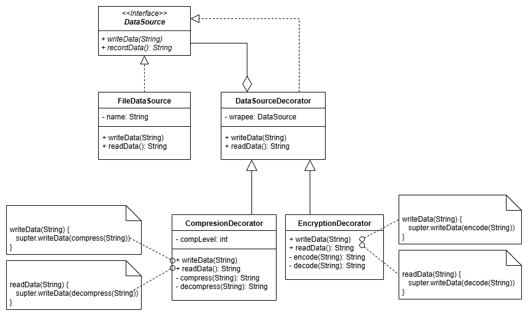

# Decorator Pattern Implementation

## UML Class Diagram


## Explanation of the Testing "Trick"
The "trick" used for testing in this implementation is the creation of a `FakeFileDataSource` class that implements the
`DataSource` interface. This is an example of the **Test Double** pattern, specifically a "Fake" implementation.

Instead of using the real `FileDataSource` which would perform actual file I/O operations (reading from and writing to
the file system), the `FakeFileDataSource` simply stores the data in memory. This has several advantages for testing:

1. **Isolation**: Tests don't depend on the file system, making them more reliable and isolated.
2. **Speed**: No actual file I/O is performed, making tests run faster.
3. **Simplicity**: No need to set up and clean up actual files for testing.
4. **Predictability**: Eliminates potential issues with file permissions, paths, or other file-system-related problems.

In the test class `DecoratorTest`, the `FakeFileDataSource` is used as the innermost component in the decorator chain,
allowing the tests to focus on the behavior of the decorators themselves without the complexity of file I/O.

## Decorator Pattern Overview
The Decorator pattern is a structural design pattern that allows behavior to be added to individual objects, either
statically or dynamically, without affecting the behavior of other objects from the same class.

Key components in this implementation:
1. **Component Interface (`DataSource`)**: Defines the interface for objects that can have responsibilities added to
them dynamically.
2. **Concrete Component (`FileDataSource`)**: Defines an object to which additional responsibilities can be attached.
3. **Decorator (`DataSourceDecorator`)**: Maintains a reference to a Component object and defines an interface that
conforms to Component's interface.
4. **Concrete Decorators (`CompressionDecorator`, `EncryptionDecorator`)**: Add responsibilities to the component.

The implementation demonstrates how multiple decorators can be stacked to add combined functionality (compression
and encryption) to a base component (file data source).

## Running the Demo

To run the decorator pattern demo:
```
mvn compile exec:java -Dexec.mainClass="edu.arizona.josesosa.structural.decorator.DecoratorDemo"
```
This will execute the `DecoratorDemo` class which demonstrates:
1. Writing data to a file with both compression and encryption
2. Reading the encoded data directly from the file
3. Reading and decoding the data through the decorator chain

The demo will output the original data, the encoded data, and the decoded data to the console.

## Running the Tests
To run the unit tests:
```
mvn test
```
This will execute all tests in the project, including:
- `DecoratorTest`: Tests the encoding and decoding functionality of the decorator pattern implementation
- `CompilerTest`: Tests the facade pattern implementation (if included in the project)

You can also run specific test classes:
```
mvn test -Dtest=DecoratorTest
```